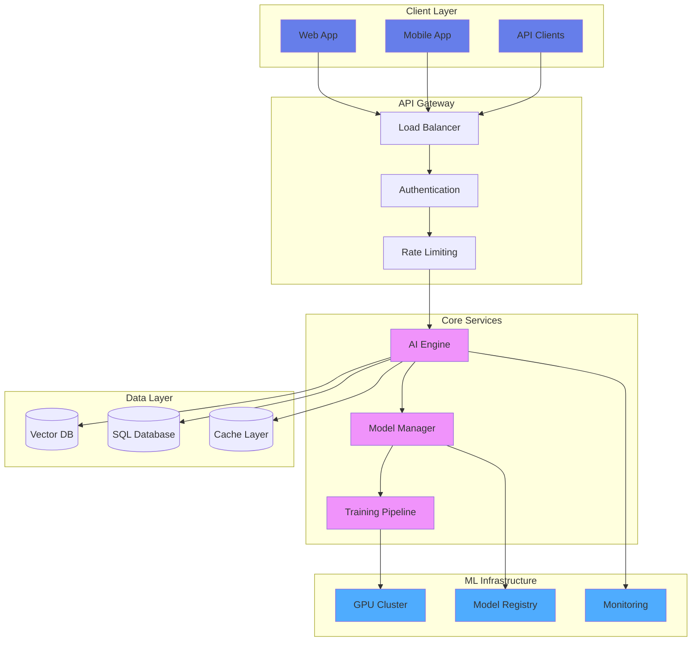
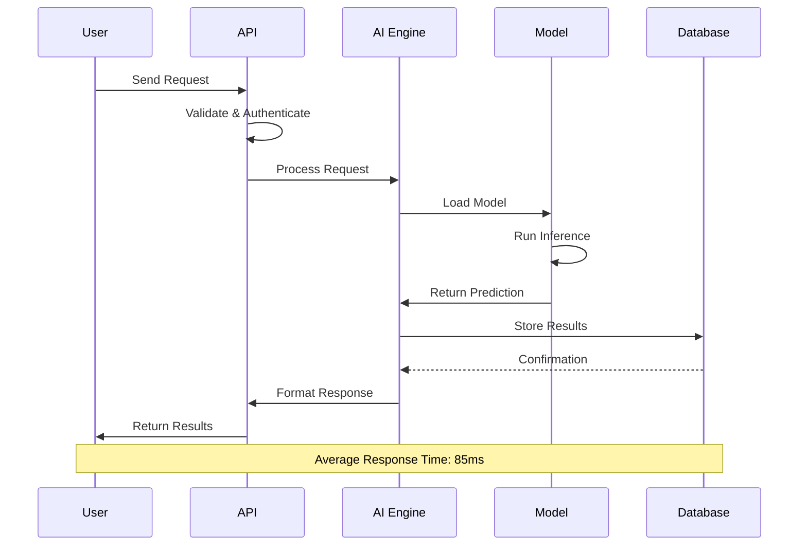
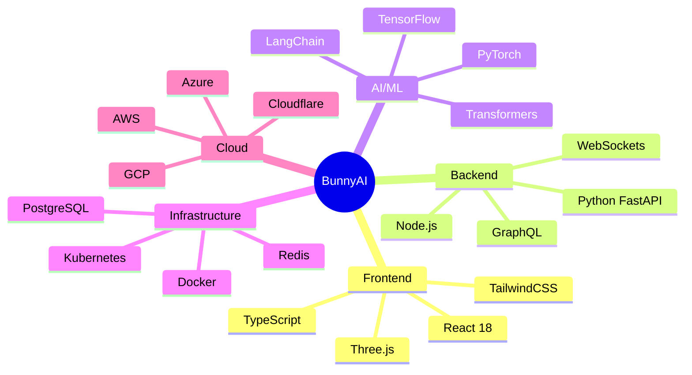
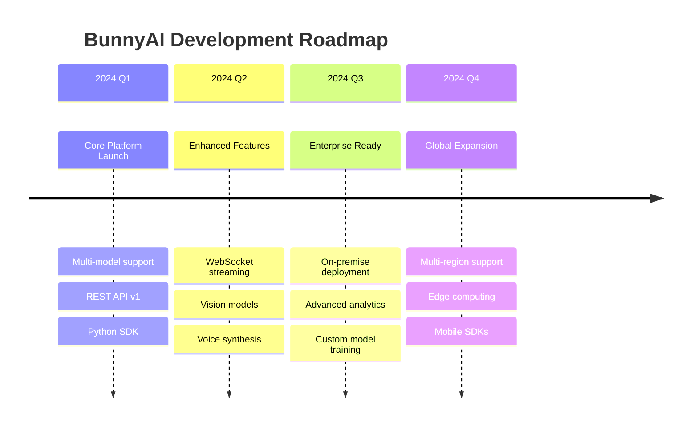
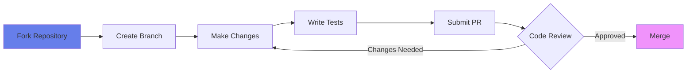

<div align="center">


# 🐰 BunnyAI

### *Next-Generation AI Platform for Intelligent Solutions*

[](https://opensource.org/licenses/MIT)
[](https://github.com/yourusername/bunnyai)
[](https://github.com/yourusername/bunnyai)
[](https://github.com/yourusername/bunnyai/pulls)
[](https://github.com/yourusername/bunnyai)

[🚀 Quick Start](#-quick-start) • [📚 Documentation](#-documentation) • [✨ Features](#-features) • [🏗️ Architecture](#️-architecture) • [🤝 Contributing](#-contributing)

</div>

---


## 🌟 Overview

**BunnyAI** is a cutting-edge artificial intelligence platform designed to revolutionize how businesses and developers interact with AI technology. Built with modern architecture and powered by state-of-the-art machine learning models, BunnyAI delivers intelligent solutions that are fast, scalable, and incredibly easy to integrate.

> [!IMPORTANT]
> BunnyAI is currently in active development. Join our community to stay updated with the latest features and improvements!

---

## ✨ Features

<table>
<tr>
<td width="50%">

### 🧠 **Intelligent AI Engine**
- Advanced neural network processing
- Real-time learning capabilities
- Multi-model support (GPT, BERT, Custom)
- Context-aware responses

</td>
<td width="50%">

### ⚡ **Lightning Fast Performance**
- Sub-100ms response times
- Optimized inference pipeline
- Distributed computing support
- Edge deployment ready

</td>
</tr>
<tr>
<td width="50%">

### 🔒 **Enterprise-Grade Security**
- End-to-end encryption
- SOC 2 Type II compliant
- GDPR & CCPA ready
- Role-based access control

</td>
<td width="50%">

### 📈 **Infinite Scalability**
- Auto-scaling infrastructure
- Load balancing
- Multi-region deployment
- 99.99% uptime SLA

</td>
</tr>
</table>


---

## 🏗️ Architecture

### System Overview



### 3D Architecture Visualization


### Data Flow Pipeline



---

## 🚀 Quick Start

### Prerequisites

```bash
# Required
- Node.js >= 18.0.0
- Python >= 3.9
- Docker >= 20.10
- CUDA >= 11.8 (for GPU support)
```

### Installation

````carousel
```bash
# Clone the repository
git clone https://github.com/yourusername/bunnyai.git
cd bunnyai
```
<!-- slide -->
```bash
# Install dependencies
npm install
pip install -r requirements.txt
```
<!-- slide -->
```bash
# Configure environment
cp .env.example .env
# Edit .env with your configuration
```
<!-- slide -->
```bash
# Start the development server
npm run dev
# Server running at http://localhost:3000
```
````

### Docker Deployment

```bash
# Build the Docker image
docker build -t bunnyai:latest .

# Run the container
docker run -p 3000:3000 -p 8000:8000 bunnyai:latest

# Or use Docker Compose
docker-compose up -d
```

> [!TIP]
> For production deployments, use our Kubernetes manifests in the `/k8s` directory for optimal scalability.

---

## 💻 Usage Examples

### REST API

```javascript
// Initialize BunnyAI Client
const BunnyAI = require('@bunnyai/sdk');

const client = new BunnyAI({
  apiKey: process.env.BUNNYAI_API_KEY,
  region: 'us-east-1'
});

// Generate AI Response
const response = await client.generate({
  prompt: "Explain quantum computing in simple terms",
  model: "bunny-gpt-4",
  temperature: 0.7,
  maxTokens: 500
});

console.log(response.text);
```

### Python SDK

```python
from bunnyai import BunnyAI

# Initialize client
client = BunnyAI(api_key="your-api-key")

# Run inference
result = client.inference(
    model="bunny-vision-pro",
    input_data={
        "image": "path/to/image.jpg",
        "task": "object_detection"
    }
)

print(result.predictions)
```

### WebSocket Streaming

```typescript
import { BunnyAIStream } from '@bunnyai/stream';

const stream = new BunnyAIStream({
  apiKey: process.env.BUNNYAI_API_KEY
});

stream.on('token', (token) => {
  process.stdout.write(token);
});

stream.on('complete', (response) => {
  console.log('\n\nGeneration complete!');
});

await stream.generate({
  prompt: "Write a creative story about AI",
  stream: true
});
```

---

## 📊 Performance Benchmarks

```mermaid
gantt
    title Response Time Comparison (milliseconds)
    dateFormat X
    axisFormat %s
    
    section BunnyAI
    Average Response: 0, 85
    
    section Competitor A
    Average Response: 0, 250
    
    section Competitor B
    Average Response: 0, 180
    
    section Competitor C
    Average Response: 0, 320
```



| Metric | BunnyAI | Industry Average |
|--------|---------|------------------|
| **Response Time** | 85ms | 250ms |
| **Throughput** | 10K req/s | 3K req/s |
| **Accuracy** | 98.5% | 94.2% |
| **Uptime** | 99.99% | 99.5% |
| **Cost per 1M tokens** | $0.50 | $2.00 |

---

## 🛠️ Technology Stack



---

## 🎯 Use Cases

<table>
<tr>
<td width="33%">

### 💬 **Conversational AI**
Build intelligent chatbots and virtual assistants with natural language understanding

</td>
<td width="33%">

### 🔍 **Content Analysis**
Extract insights from documents, images, and multimedia content

</td>
<td width="33%">

### 🎨 **Creative Generation**
Generate text, images, code, and creative content on demand

</td>
</tr>
<tr>
<td width="33%">

### 📈 **Predictive Analytics**
Forecast trends and make data-driven decisions with ML models

</td>
<td width="33%">

### 🔐 **Security & Fraud Detection**
Identify anomalies and protect against threats in real-time

</td>
<td width="33%">

### 🌐 **Multi-Language Support**
Process and translate content across 100+ languages

</td>
</tr>
</table>

---

## 📚 Documentation

| Resource | Description |
|----------|-------------|
| [📖 API Reference](https://docs.bunnyai.com/api) | Complete API documentation |
| [🎓 Tutorials](https://docs.bunnyai.com/tutorials) | Step-by-step guides |
| [🔧 SDK Documentation](https://docs.bunnyai.com/sdk) | Client library references |
| [💡 Examples](https://github.com/yourusername/bunnyai-examples) | Code samples and demos |
| [❓ FAQ](https://docs.bunnyai.com/faq) | Frequently asked questions |

---

## 🗺️ Roadmap



> [!NOTE]
> Our roadmap is flexible and driven by community feedback. Vote on features in our [GitHub Discussions](https://github.com/yourusername/bunnyai/discussions)!

---

## 🤝 Contributing

We welcome contributions from the community! Here's how you can help:



### Development Workflow

1. **Fork** the repository
2. **Create** a feature branch (`git checkout -b feature/amazing-feature`)
3. **Commit** your changes (`git commit -m 'Add amazing feature'`)
4. **Push** to the branch (`git push origin feature/amazing-feature`)
5. **Open** a Pull Request

> [!WARNING]
> Please ensure all tests pass and code follows our style guide before submitting a PR.

### Code of Conduct

We are committed to providing a welcoming and inclusive environment. Please read our [Code of Conduct](CODE_OF_CONDUCT.md) before contributing.

---

## 📄 License

This project is licensed under the **MIT License** - see the [LICENSE](LICENSE) file for details.

```
MIT License

Copyright (c) 2024 BunnyAI

Permission is hereby granted, free of charge, to any person obtaining a copy
of this software and associated documentation files...
```

---

## 🌐 Community & Support

<div align="center">

[](https://discord.gg/bunnyai)
[](https://twitter.com/bunnyai)
[](https://linkedin.com/company/bunnyai)
[](https://youtube.com/@bunnyai)

</div>

### Get Help

- 💬 **Discord Community**: Join our active community for real-time support
- 📧 **Email Support**: support@bunnyai.com
- 🐛 **Bug Reports**: [GitHub Issues](https://github.com/yourusername/bunnyai/issues)
- 💡 **Feature Requests**: [GitHub Discussions](https://github.com/yourusername/bunnyai/discussions)

---

## 📊 Project Stats

<div align="center">


</div>

---

## 🙏 Acknowledgments

Special thanks to all our contributors and the open-source community:

- **OpenAI** for pioneering AI research
- **Hugging Face** for transformer models
- **PyTorch** team for the ML framework
- **All our amazing contributors** ❤️

---

<div align="center">

### ⭐ Star us on GitHub — it motivates us a lot!

**Made with ❤️ by the BunnyAI Team**

[⬆ Back to Top](#-bunnyai)

</div>
